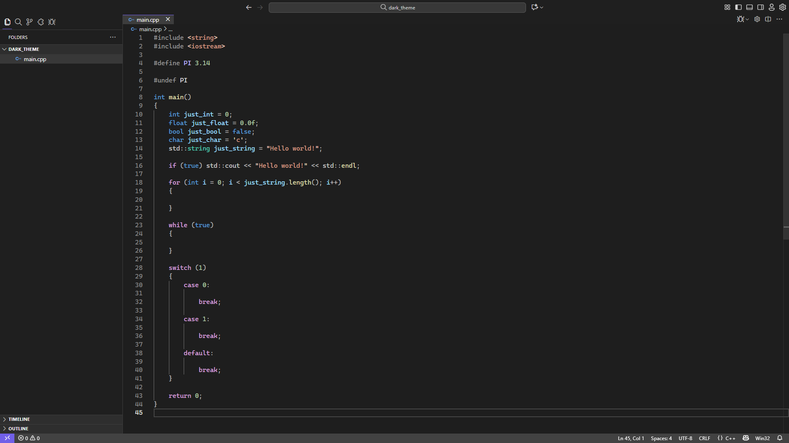
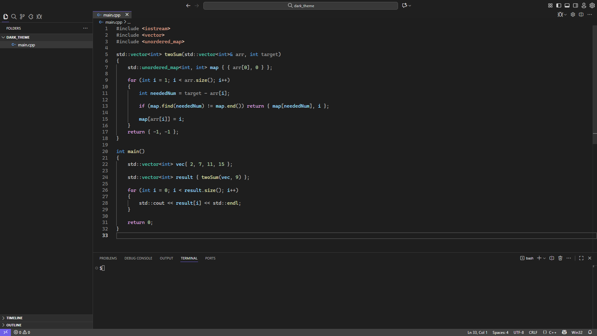

# Dark theme from Visual Studio 2022

This extension provides dark color theme inspired by Visual Studio 2022. It includes semantic highlighting.

For better experience you should install "Cascadia Mono" font from [here](https://github.com/microsoft/cascadia-code).

    
<b>Supported languages</b>

    | Language |   Status   |
    |----------|------------|
    | С/C++    |   Full✅   |
    | C#       |   Full✅   |
    | Go       |   Full✅   |
    | Java     |  Planned❌ |
    | Python   |   Full✅   |
    | HTML     |   Full✅   |
    | CSS      |  Planned❌ |
    | JS       |  Planned❌ |
    | TS       |  Planned❌ |
    | Shell    |   Full✅   |
    | CMake    |  Planned❌ |
    | Markdown |  Planned❌ |
    | SQL      |  Planned❌ |
    | JSON     |   Full✅   |
    | XML      |   Full✅   |

## Images

### Legal Notice
- This repository is not affiliated with Microsoft Corporation.
- Visual Studio and Visual Studio Code are trademarks of Microsoft Corporation.
